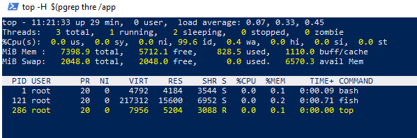
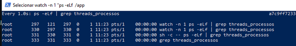
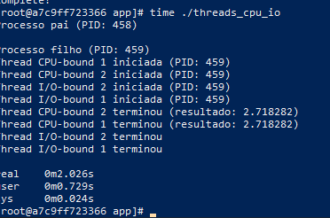
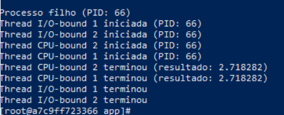
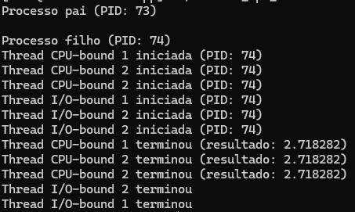

# S.O. 2025.1 - Atividade 04 - Prática de Escalonamento de Tarefas

**Aluno:** [Daniel Braga](https://github.com/DanielBR0612)  

### 1 Análise de desempenho
  

 

 

### 2.2 Compilação do Programa

